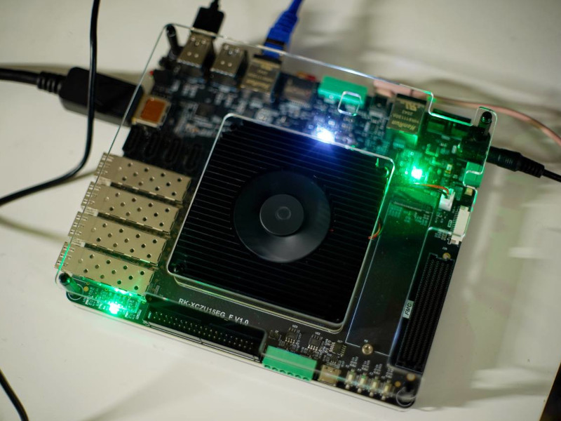

# RK-XCZU15EG-F — Board Support Package & Debian/Ubuntu Image Template



A reusable, scripted **board support package (BSP)** for the **RK-XCZU15EG-F**
development board (RIGUKE / "日固刻", a Zynq UltraScale+ MPSoC board based on the
**XCZU15EG-FFVB1156-2-I**, pin-compatible with the ALINX/正点原子 MPSoC-P5 family).

It turns the bare board into a board that:

- **Boots the PS** through the standard ZynqMP chain — FSBL → PMUFW → ATF → U-Boot.
- Runs a **real, `apt`-capable Debian (or Ubuntu) arm64** root filesystem — not a
  BusyBox/Yocto image. `apt update && apt install …` works on the board.
- Comes up with **SSH** over the on-board Gigabit Ethernet (PS GEM3 → RTL8211F).
- Can **load an FPGA bitstream from the running PS/Linux side** at run time via the
  ZynqMP FPGA manager (PCAP) — no JTAG, no rebuilt BOOT.BIN, no reboot.

Everything is **source + scripts**: nothing here is a black-box binary you cannot
regenerate. Point it at a new Vivado design and rebuild — it is meant to be the
starting template for future XCZU15EG projects.

---

## 1. Board at a glance

| | |
|---|---|
| SoC | Xilinx Zynq UltraScale+ **XCZU15EG-FFVB1156-2-I** |
| PS DDR4 | 4 GB, DDR4-2400 (64-bit) |
| PL DDR4 | separate fabric-side DDR4 bank (MIG) |
| eMMC | Samsung **KLM8G1GETF** 8 GB, 8-bit, on PS SD0 (`mmcblk0`) |
| micro-SD | on PS SD1 (`mmcblk1`) — **boot + rootfs live here** |
| QSPI boot flash | 2 × Macronix **MX25U51245G** (128 MB), dual-parallel |
| Console | PS **UART0** → USB-UART, **115200 8N1**, `ttyPS0` |
| Ethernet (primary) | PS **GEM3** (MIO 64–77) → **RTL8211F** RGMII — used for SSH |
| Ethernet (secondary) | PS GEM0 → PL `gmii_to_rgmii` → 2nd RTL8211F (needs a PL bitstream) |
| Other PS | I2C1, CAN0/1, USB3.0 (DWC3), DisplayPort, PCIe root-port |
| Toolchain | Vivado / Vitis / XSCT **2025.2**; upstream Xilinx `xilinx-v2025.2` |

**Boot-mode DIP switch** (ON side = 0):

| Mode | SW `4 3 2 1` |
|------|--------------|
| **SD card (SD1)** | `0 1 0 1` |
| QSPI32 | `0 0 1 0` |
| eMMC (SD0) | `0 1 1 0` |
| JTAG | `0 0 0 0` |

---

## 2. What's in here

```
board/                       The BSP proper (hardware definition)
  XCZU15EG_Base_Config.tcl     PS preset: MIO map, DDR4, clocks, peripherals
  constraints/                 PL pin constraints (XDC) – LEDs, keys, UART,
                               RS485, RGMII, 200 MHz clock, PL-DDR4
  device-tree/                 system-user.dtsi + gen_devicetree.sh (XSCT flow)
  hw-handoff/                  golden hardware hand-off: XSA, psu_init, .bit
hw/                          Vivado block-design generator (create_project.tcl)
boot/                        FSBL/PMUFW/ATF/U-Boot build + bootgen -> BOOT.BIN
linux/                       linux-xlnx kernel build + board config fragment
rootfs/                      mmdebstrap Debian/Ubuntu rootfs + first-boot overlay
image/                       rootless SD-card image assembler
scripts/                     env.sh, fetch_sources.sh, bit2bin.sh
examples/                    e.g. a PL bitstream + overlay you load from Linux
docs/                        detailed guides (architecture, build, bitstream, pinout)
Makefile                     one-shot orchestration
```

See **`docs/`** for the deep dives:
- `docs/01-board-overview.md` – hardware reference
- `docs/02-architecture.md` – the full boot flow, who configures what
- `docs/03-build-guide.md` – step-by-step build
- `docs/04-bitstream-from-ps.md` – loading the PL from Linux
- `docs/05-pinout-reference.md` – every pin used
- `docs/06-reuse-guide.md` – **how to fork this for a new project**

---

## 3. Prerequisites (build host: x86-64 Linux)

- **Vivado + Vitis 2025.2** (for the hardware, FSBL/PMUFW, bootgen). Other
  versions work too — set `XILINX_VERSION`.
- A cross toolchain + build tools:
  ```bash
  sudo apt-get install -y \
    mmdebstrap debootstrap qemu-user-binfmt binfmt-support \
    mtools dosfstools gdisk u-boot-tools device-tree-compiler \
    gcc-aarch64-linux-gnu build-essential bison flex libssl-dev \
    swig libgnutls28-dev bc cpio rsync xz-utils zstd uidmap
  ```
- The rootfs builds **rootlessly** via user namespaces. On Ubuntu ≥ 24.04 enable
  unprivileged user namespaces once:
  ```bash
  sudo sysctl -w kernel.apparmor_restrict_unprivileged_userns=0
  ```
  (or run the `rootfs`/`sdcard` steps with `sudo`).

---

## 4. Quick start

```bash
source <Vivado>/settings64.sh && source <Vitis>/settings64.sh   # for hw/boot steps

make sources        # clone u-boot / atf / linux / device-tree-xlnx @ xilinx-v2025.2
make devicetree     # board/hw-handoff/IMAGE_15EG.xsa  ->  system.dtb
make boot           # FSBL + PMUFW + ATF + U-Boot      ->  BOOT.BIN  (no bitstream)
make kernel         # linux-xlnx                        ->  Image + modules
make rootfs         # Debian bookworm arm64             ->  rootfs.tar.zst
make sdcard         # assemble                          ->  build/out/sdcard.img
```

Build an Ubuntu image instead:
```bash
make rootfs ROOTFS_DISTRO=ubuntu ROOTFS_SUITE=noble
```

Flash and boot:
```bash
sudo dd if=build/out/sdcard.img of=/dev/sdX bs=4M conv=fsync status=progress
# set the boot DIP to SD (4 3 2 1 = 0 1 0 1), insert the card, power on
```

The board boots to a serial console on `ttyPS0` (115200 8N1) and brings up
Ethernet via DHCP. Default credentials (change them!):

| user | password |
|------|----------|
| `riguke` | `riguke` |
| `root` | `root` |

```bash
ssh riguke@<board-ip>
```

---

## 5. Load a bitstream from the PS (Linux) side

On the build host, convert your Vivado `.bit` to a raw bitstream and copy it over:
```bash
scripts/bit2bin.sh my_design.bit            # -> my_design.bit.bin
scp my_design.bit.bin riguke@<board-ip>:/lib/firmware/
```
On the board:
```bash
sudo load-bitstream.sh /lib/firmware/my_design.bit.bin
sudo load-bitstream.sh --status            # fpga manager state == "operating"
```
`load-bitstream.sh` uses the kernel FPGA manager through a device-tree overlay
on `&fpga_full` (with a legacy-sysfs fallback). Full details and partial-
reconfiguration notes are in `docs/04-bitstream-from-ps.md`, and a ready-to-run
example is in `examples/`.

---

## 6. Reuse for a new project

The short version (full guide in `docs/06-reuse-guide.md`):

1. Fork this repo; keep `board/` (it *is* the board).
2. Put your IP in `hw/create_project.tcl` (the "USER PL LOGIC" section) and
   `make hw` to produce a new `system.xsa` + bitstream.
3. Point `XSA=…/system.xsa` at it and `make devicetree boot`.
4. `make kernel rootfs sdcard`.

Because the PS preset, constraints and device tree live in `board/`, a new
project is "drop in your PL design and rebuild".

---

## 7. Provenance

Hardware facts were reconstructed from the vendor materials shipped with the
board (user manual, FPGA/Vitis/Linux tutorials, schematics, the factory
PetaLinux BSP `image_15eg.bsp`, the `XCZU15EG_Base_Config` PS preset and the
demo projects). The golden hardware hand-off in `board/hw-handoff/`
(`IMAGE_15EG.xsa`, `IMAGE_15EG_wrapper.bit`, `psu_init*`) is the factory
2020.2 design, kept as a known-good reference; everything else is rebuilt from
source against the 2025.2 toolchain.
